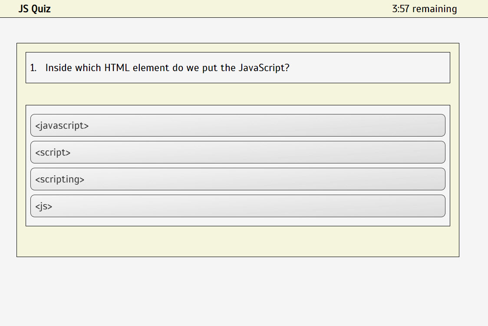
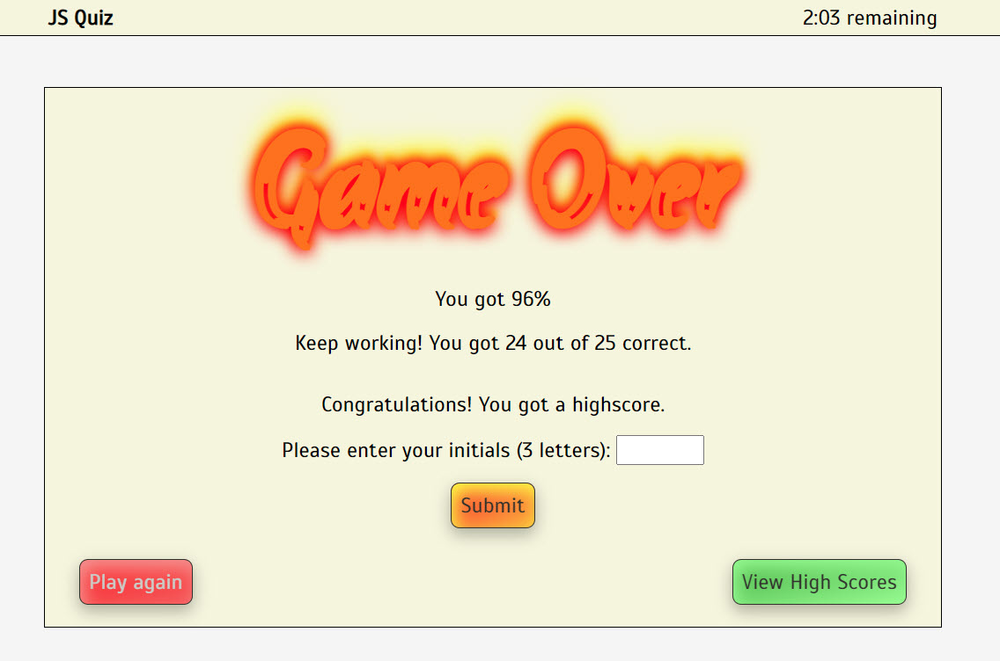
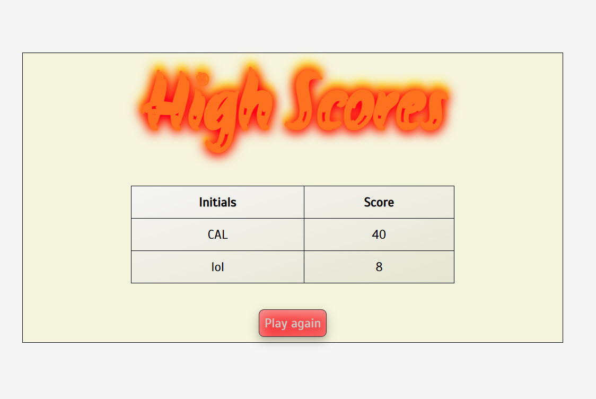

# JS Code Quiz

## Description

Build a timed coding quiz with multiple-choice questions. This app will run in the browser and will feature dynamically updated HTML and CSS powered by JavaScript code. It will have a clean, polished, and responsive user interface.

I started with pseudocode: [jsCodeGame-Pseudocode.txt](./assets/misc/jsCodeGame-Pseudocode.txt)

I had a hard time with getting the JSON that I used to store the questions in to work properly. I couldn't get it to import the file without adding extra overhead. But the object I stored wouldn't escape '\n' and '\"' characters correctly so I substituted those characters with placeholders and then swapped them back out when I was displaying the lines in HTML. I actually went back and ditched the JSON for the questions and just made a giant array of manually entered questions.

The rest of the work was pretty smooth. I had fun with formatting. The pages are all responsive. I found some fun code to work with for CSS formatting.

I wanted to add a screen that listed the correct answers along with how the answers were entered. I also intended to shuffle the questions and the answers so that they weren't the same every time, but I ran out of time and they weren't requirements.

## Table of Contents

- [User Story](#user-story)
- [Acceptance Criteria](#acceptance-criteria)
- [Usage](#usage)
- [Credits](#credits)
- [Screenshots](#screenshots)

## User Story

AS A coding boot camp student
I WANT to take a timed quiz on JavaScript fundamentals that stores high scores
SO THAT I can gauge my progress compared to my peers

## Acceptance Criteria

Here are the critical requirements necessary to develop a portfolio that satisfies a typical hiring manager’s needs:

```
GIVEN I am taking a code quiz

WHEN I click the start button
THEN a timer starts and I am presented with a question

WHEN I answer a question
THEN I am presented with another question

WHEN I answer a question incorrectly
THEN time is subtracted from the clock

WHEN all questions are answered or the timer reaches 0
THEN the game is over

WHEN the game is over
THEN I can save my initials and my score
```

## Usage

Completed site: [https://chip-l.github.io/jsCodeQuiz/]

## Credits

Study Group:

- Lauren Gabaldon
- Josh Lee
- Jared Sutch
- Lacey Pape
- Alex Jurgs
- Tarik Maggio

Questions: I'll be honest, I stole these questions directly from W3Schools (https://www.w3schools.com/quiztest/quiztest.asp?qtest=JS)

Makan. (2020, May 9). Glowing Flames Text Animation. CodeMyUI. https://codemyui.com/glowing-flames-text-animation/.

## Screenshots







